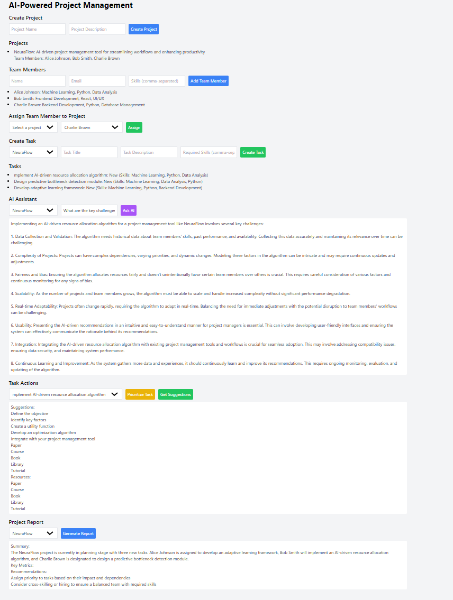
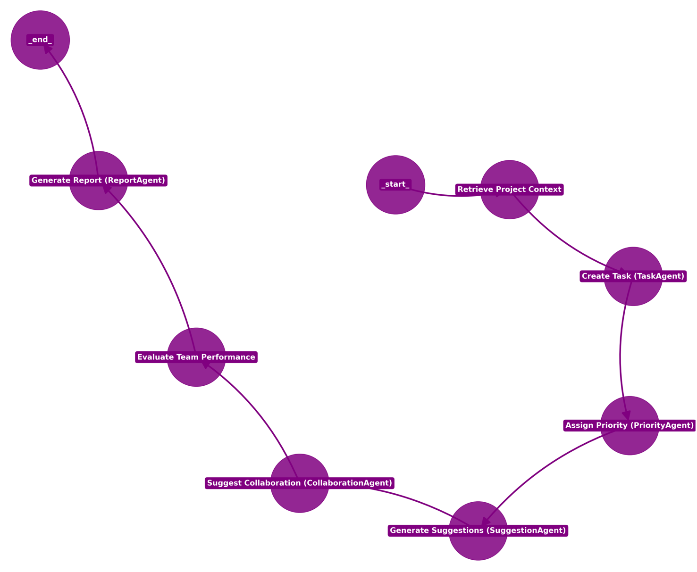

# **Project Management System with RAG**

This project is an **Project Management System** utilizing **Retrieval-Augmented Generation (RAG)** to streamline the management of complex projects. By combining AI-driven techniques with structured workflows, the system offers enhanced efficiency in task execution, team collaboration, and decision-making processes. I have also written a [Medium article](https://medium.com/towards-artificial-intelligence/revolutionizing-project-management-with-ai-agents-and-langgraph-ff90951930c1) about this project, detailing its features, implementation, and applications.

## **Menu Screen**


## **Diagram Flow**


## **Key Features**

- **Task Management with AI Assistance**: The `TaskAgent` generates tasks based on project descriptions and historical data. The `PriorityAgent` analyzes and prioritizes tasks using a data-driven approach.
- **Retrieval-Augmented Generation (RAG)**: The system implements RAG, which integrates FAISS for similarity search and language models via `langchain_ollama` and `langchain_groq` to deliver context-aware task suggestions, reports, and recommendations.
- **Team Collaboration and Formation**: The `CollaborationAgent` analyzes team capabilities and project requirements to suggest optimal team configurations and communication strategies.
- **Comprehensive Project Reporting**: The `ReportAgent` generates detailed reports on project progress, including key metrics, risks, and insights, helping project managers make informed decisions.
- **Workflow Orchestration with LangGraph**: The system orchestrates project workflows using a **graph-based approach**, where tasks are represented as nodes in a **stateful graph**. Each node corresponds to a specific step in the project lifecycle—such as task creation, priority assignment, and report generation. This allows for highly adaptable workflows that can dynamically adjust based on project context and changes. LangGraph ensures that the transitions between these steps are logical, structured, and responsive to project updates in real time.

## **Tech Stack**

- **AI & NLP Frameworks**: `LangChain` for embeddings and retrieval tasks, `Langchain_ollama` for embeddings, `Langchain_groq` for AI-based suggestions, and `LangGraph` for managing stateful workflows.
- **Backend Framework**: FastAPI, integrated with SQLAlchemy for database interactions.
- **Vector Store**: FAISS for storing and retrieving embeddings based on similarity search.
- **Authentication**: OAuth2 with JWT for secure access.
- **Database**: SQLAlchemy for persistent data storage.

## **Retrieval-Augmented Generation (RAG) Overview**

RAG combines two core components:
1. **Retriever**: The system uses FAISS to perform similarity search on stored embeddings, allowing it to identify relevant documents or data points from the project history.
2. **Generator**: Once relevant documents are retrieved, the system leverages `langchain_groq` for generating contextually aware outputs based on the retrieved data. This hybrid retrieval-generation mechanism ensures that suggestions and reports are both data-driven and contextually meaningful.

## **Stateful Workflow and Task Automation**

The workflow system is designed around a **graph-based structure**, where each task and action in the project lifecycle is modeled as a node within the graph. These nodes are connected by edges that define the sequence of actions—from task creation, prioritization, and suggestions, to collaboration and report generation. The system’s **state management** ensures that each task’s status is tracked, and workflows can dynamically adapt based on real-time project updates, allowing for flexibility in project execution.

For example, when a task is created, the system moves it through the workflow to assign a priority, generate suggestions, recommend collaborations, and finally produce a comprehensive report. This graph-based approach, powered by **LangGraph**, ensures that workflows are both adaptable and structured, responding efficiently to changes in project context.


## **Getting Started**

### **Prerequisites**

- Python 3.10
- SQLAlchemy database instance
- OpenAI or Groq API Key for enhanced AI capabilities
- FAISS installation


### **Installation**

**Clone the Repository:**
```bash
git clone https://github.com/your-username/AI_Powered_Project_Management_System_with_RAG.git
cd AI_Powered_Project_Management_System_with_RAG
 ```

**Install the Dependencies:**
```bash
pip install -r requirements.txt
```

**Launch the Application:**
```bash
uvicorn main:app --reload
```

## **Project Components**

**1. Vector Store**
This module handles the creation and management of **FAISS-based vector stores** for document embeddings, using **OllamaEmbeddings** (model -> all-minilm) for embedding generation. It supports both vector store creation and similarity search.

Example usage:
```python
from backend.ai_engine.rag.vector_store import VectorStore
vector_store = VectorStore()
vector_store.create_vector_store(texts, metadatas)
```

**2. Collaboration Agent**
The **CollaborationAgent** generates team formation and communication plan suggestions for tasks. It uses a model from **langchain_groq** to generate relevant, context-aware recommendations based on project data and team member capabilities.

Example usage:
```python
from backend.ai_engine.agents.collaboration_agent import CollaborationAgent
collaboration_agent = CollaborationAgent(retriever)
response = collaboration_agent.suggest_collaboration(task, project_id)
```

**3. Workflow Management**
This module manages the project workflow using a graph-based state manager. The workflow connects nodes like task creation, priority assignment, suggestion generation, and reporting, ensuring logical progression through each phase of the project.
Example usage:
```python
from backend.ai_engine.workflow.graph import create_workflow
workflow = create_workflow()
workflow()
```

## **Example Output**

Sample project created by the AI system:
```bash
Project: NeuraFlow
Team Members: Alice Johnson (Machine Learning), Bob Smith (Frontend Development), Charlie Brown (Backend Development)
Tasks:
1. Implement AI-driven resource allocation algorithm
2. Design predictive bottleneck detection module
```

Generated suggestions for tasks:
```bash
Task: Implement AI-driven resource allocation algorithm
Suggestions:
- Define the objective
- Identify key factors
- Develop an optimization algorithm
```

## **License**

This project is licensed under the MIT License. You are free to use, modify, and distribute this software as per the terms of the license. See the full license text in the `LICENSE` file included in this repository.

MIT License © 2024 Yotam Braun

